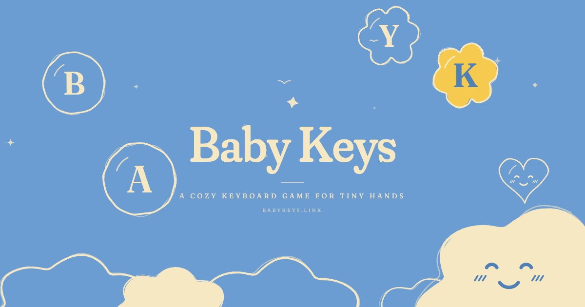

# Baby Keys

A cozy keyboard game for babies and toddlers. Every key makes a hand-drawn shape pop up with a sound. Play it at [babykeys.link](https://babykeys.link).

## Levels

Pick a level from the settings button in the top-right corner.

- **Free play (1+)**: every letter and number pops up a glossy shape with that letter on it, placed where the key sits on the keyboard. Each keyboard row has its own sound: numbers twinkle, the top row rings like bells, the middle row is a xylophone and the bottom row bloops like bubbles. The notes all come from one pentatonic scale, so random mashing still sounds nice. Space draws a rainbow and Enter launches fireworks. Taps and clicks make little shapes with blinking faces, so this level works on phones and tablets too.
- **Find the letter (2+)**: a bubble shows a letter, and pressing that key pops it. A little keyboard at the bottom lights up where the key is. Wrong keys just make the bubble wobble.
- **Challenge (4+)**: type your name, then pop as many as you can. Each bubble has a 5-second countdown: 5 points in the first second, 1 point less each second after, and 0 after 5 seconds (you can still pop it). One wrong key and it's game over, with your score, a rank and a high-score board by name. Numbers join in after 12 bubbles.

It goes full screen on the first key press. Holding a key down only plays it once, and the volume is capped.

It's one HTML file with no build step and no dependencies. Open `index.html` in a browser to play.

## Analytics

Uses [PostHog](https://posthog.com) in cookieless mode: no cookies and no personal data. It records which level was played, how long a session lasted, how many keys were pressed, and Challenge scores. It never records which keys were pressed or any player names. Names and high scores are only saved in the browser on that computer.
